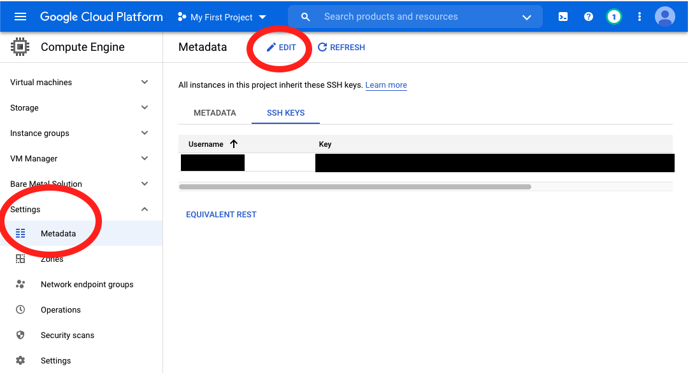

# Setup a Google Cloud TPU VM

This is my workflow for setting up a new Google Cloud TPU VM.  
This tutorial starts from the point where you applied for the TPU Research Cloud (TRC) program
and created a project according to the program's instructions.

## Creating a Cloud TPU Node

In the **TPUs** page, click **CREATE TPU NODE**.  
Remember to select the correct architecture and zone to use the TPUs TRC offered you.  
There will be a prompt when the TPU is available for TRC,
like [this](https://twitter.com/KimboChen/status/1444653799096741896?s=20).

## Adding An SSH Public Key

From the sidebar, select **Settings > Metadata**.  
Select the **SSH KEYS** tab and click **EDIT**.

The **username** will be the one in the SSH command.  

Click **ADD ITEM** and enter the public key of your local computer.  
Click **SAVE**.

## Connecting to the TPU VM

In the **TPUs** page, copy the **External IP** of your TPU VM.  
Connect to the VM with this command:
```bash
ssh <USERNAME>@<EXTERNAL_IP>
# USERNAME: The username that is shown in the SSH KEYS tab.
# EXTERNAL_IP: The external IP of your TPU VM.
```

## Generate an SSH Key Pair for Accessing GitHub

Generate a new SSH key:
```bash
ssh-keygen -t ed25519 -C "your_email@example.com"
```

Start the SSH agent:
```bash
eval "$(ssh-agent -s)"
```

Add your SSH private key to the agent:
```bash
ssh-add ~/.ssh/id_ed25519
```

At GitHub, select upper-right avatar icon, go to **Settings > SSH and GPG keys**.  
Add the public key to the list of keys.

Test your SSH connection:
```bash
ssh -T git@github.com
```

If all works correctly, you can now clone repos to your TPU VM.

## Setup Bash

Create an alias for Python3:
```bash
echo "alias python='python3'" >> .bashrc
echo "export EDITOR='vim'" >> .bashrc
```
This helps you avoid invoking Python2.

## Installing JAX

TPU VMs lack the package to create Python virtual environments.  
Thus, I chose not to create any and directly install JAX.
```bash
pip install "jax[tpu]>=0.2.16" -f \
    https://storage.googleapis.com/jax-releases/libtpu_releases.html
```

## Setup tmux

Create `~/.tmux.conf`:
```tmux
set -g default-terminal "tmux-256color"
set-window-option -g mode-keys vi
```

## Setup Vim

Install Vim-plug:
```bash
curl -fLo ~/.vim/autoload/plug.vim --create-dirs \
    https://raw.githubusercontent.com/junegunn/vim-plug/master/plug.vim
```

Create `~/.vimrc`:
```vim
call plug#begin('~/.vim/plugged')
  Plug 'easymotion/vim-easymotion'
  Plug 'machakann/vim-sandwich'
  Plug 'rafi/awesome-vim-colorschemes'
  Plug 'sheerun/vim-polyglot'
call plug#end()

let g:sonokai_style = 'shusia'
let g:sonokai_better_performance = 1
colorscheme sonokai

set tabstop=4
set shiftwidth=4
set expandtab

set autoindent
set smartindent

set number
set incsearch
set hlsearch

set termguicolors
set term=xterm-256color

set splitright
set splitbelow

syntax on
let mapleader = " "
```

Install Vim plugins:
```bash
vim -c "PlugInstall"
```

## EndNote

Vim colorschemes breaks easily on Tmux.
When in trouble, try to make colorschemes work without Tmux first.

## References

- https://docs.github.com/en/authentication/connecting-to-github-with-ssh
- https://docs.github.com/en/authentication/connecting-to-github-with-ssh/testing-your-ssh-connection
- https://cloud.google.com/tpu/docs/jax-quickstart-tpu-vm
- https://github.com/junegunn/vim-plug
